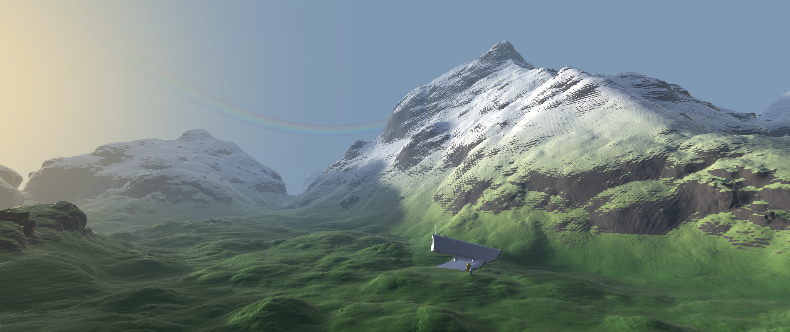
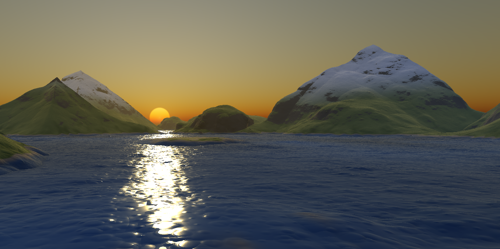

# SDF Engine

A real-time Signed Distance Function (SDF) engine featuring sparse brick storage,
hardware ray tracing, and an integrated SDF-based physics engine.

Developed as my Bachelor's Thesis at the University of Zaragoza (UNIZAR).

## Screenshots

<p align="center">
  
</p>

<p align="center">
  
</p>

## Features

- Sparse Brick Set representation with an LOD cache for distance values
- XPBD physics engine using SDF-based constraints
- Hardware ray tracing of implicit surfaces
- Deferred renderer with:
  - Physically Based Rendering (PBR)
  - Directional lighting
  - Exponential fog
- Ray-marched / ray-traced shadows
- Ambient Occlusion computed from SDF values
- Shadow and AO denoising using downsampling + bilateral blur
- Hot shader reloading
- Full editor with:
  - Gizmos
  - Scene loading/saving
  - Drag-and-drop editing
  - Profiler
  - Logger
  - Tonemapping
- Debug visualization and interactive tools

## Requirements

- Vulkan SDK 1.4+
- CMake ≥ 3.22
- C++20 compiler
- `nvpro_core2` (included as a submodule)

Optional:

- cereal (scene serialization)
- zenity (file dialogs on Linux)

## Building

### Release

```bash
cmake -S . -B build \
    -DCMAKE_BUILD_TYPE=Release \
    -DCMAKE_EXPORT_COMPILE_COMMANDS=ON
```

### Debug

```bash
cmake -S . -B build \
    -DCMAKE_BUILD_TYPE=Debug \
    -DCMAKE_EXPORT_COMPILE_COMMANDS=ON
```

Compile:

```bash
cmake --build build --parallel
```

Run:

```bash
./_bin/tfg
```

## License

`nvpro_core2` and this project is licensed under [Apache 2.0](LICENSE).
Developed as my Bachelor's Thesis at the University of Zaragoza (UNIZAR). Directors:
- Alfonso López Ruiz
- Néstor Monzón González


